# Week 0 — Billing and Architecture

For this week, we learned about the architecture of the Cruddur app, setting up AWS group, users and permission and setting up the billing of our account.

## Required Homework

### Recreate Conceptual Diagram in Lucid Charts

[Conceptual Diagram Lucid Link](https://lucid.app/lucidchart/8361737b-54e1-4f46-ac6c-af16d65bd388/edit?viewport_loc=-3151%2C-1376%2C2328%2C1106%2C0_0&invitationId=inv_846d6836-7dbf-4d64-bbe6-f0b0bafcc3b8)

### Recreate Logical Architectual Diagram in Lucid Charts

[Logical Diagram Lucid Link](https://lucid.app/lucidchart/39d35bd5-5a18-44de-aa2f-5e16be91cc5e/edit?viewport_loc=-400%2C-609%2C3487%2C1893%2C0_0&invitationId=inv_cec5b94d-947f-478e-a654-a67c5e94dd93)

### Create an Admin User

I created a user group "user-dev-admin" and attached the admin policy.

My root account is **timmy-cde** and my admin user is **tim-dev**.

- User group **user-dev-admin** and admin user **tim-dev**
  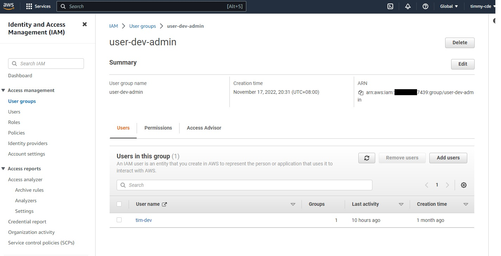

- User Group Policies
  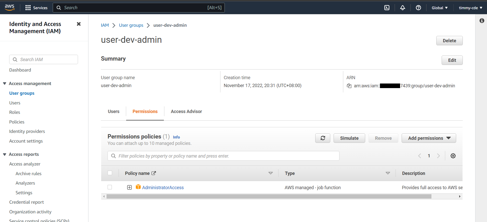

### Generate AWS Credentials

I installed aws cli on gitpod and also added it on [.gitpod.yml](../.gitpod.yml)

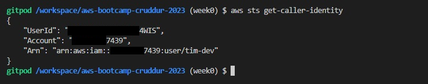

### Create Billing Alarm

From here on, I first set the SNS, Alarm and Budget using _console_ before recreating it using _aws cli._

- SNS Topic (Console)

  As you can see the image below, **Default_CloudWatch_Alarms_Topic** is set using aws console and the **billing-alarm** is set using aws cli.
  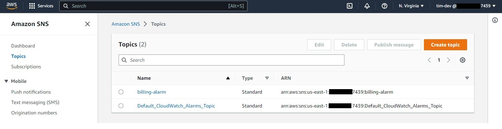

- SNS Topic (CLI)

  For setting SNS using AWS CLI I first generated a SNS Topic ARN.
  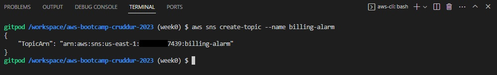

  Subscribe to SNS created

  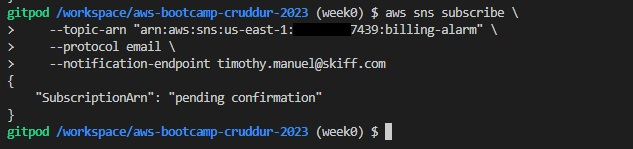

  Confirmed the sns subscription sent on the email (I used my mobile phone to confirm).
  | Email Confirmation | Confirmed |
  | :---: | :---: |
  | 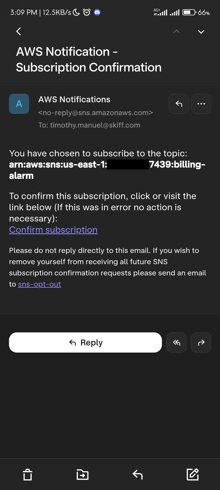 | 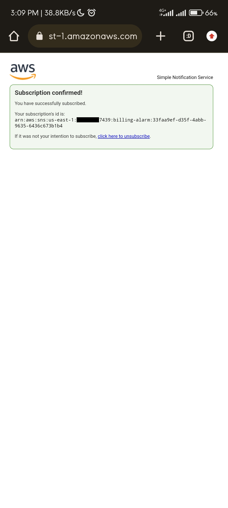 |

  Checked my subscriptions on the cli. The list shows 2 items since I first created my subscription using console before recreating it again on cli.
  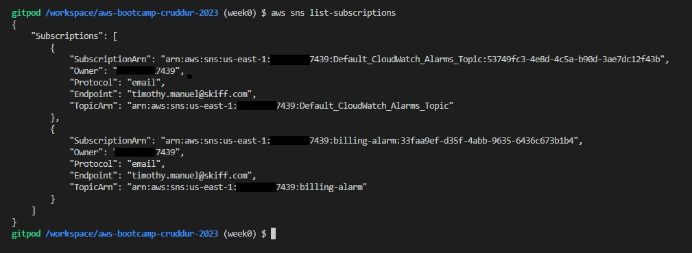

- Billing Alarm

  Here we set the alarm using `cloudwatch put-metric` command with the file [alarm-config.json](../aws/json/alarm-config.json). Contrary to the $1 limit that is used on the video, I changed the threshold to 100 so that the alarm will only start to trigger if it is 80% of $100. After this, I then checked in the cli the list of cloudwatch alarms.
  | 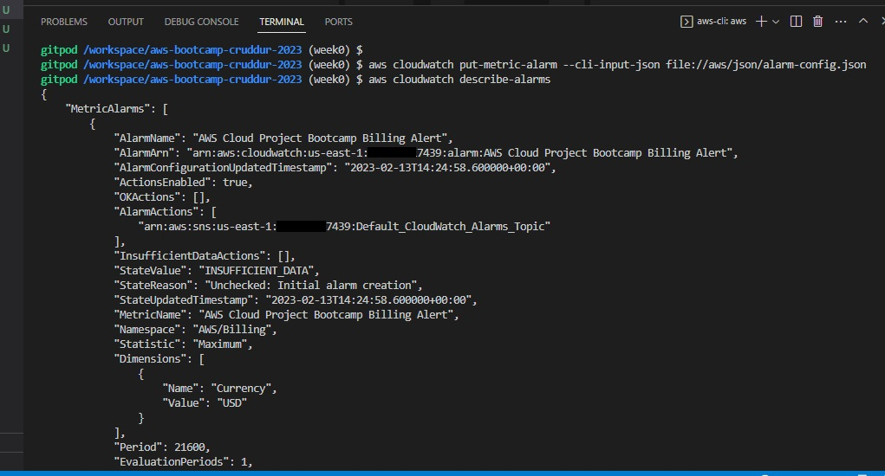 |
  | ---------------------------------------------------------------------- |
  | 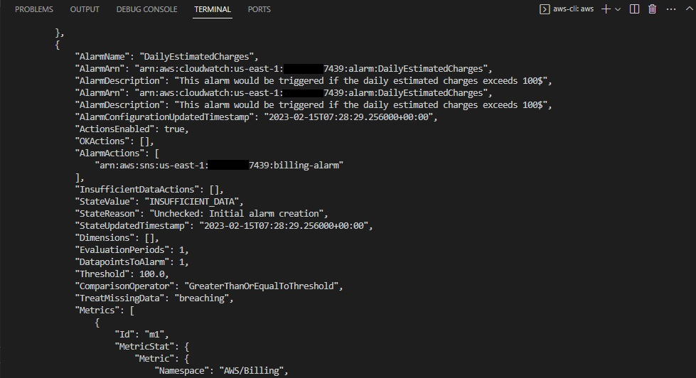 |

  We can also view it in the console.
  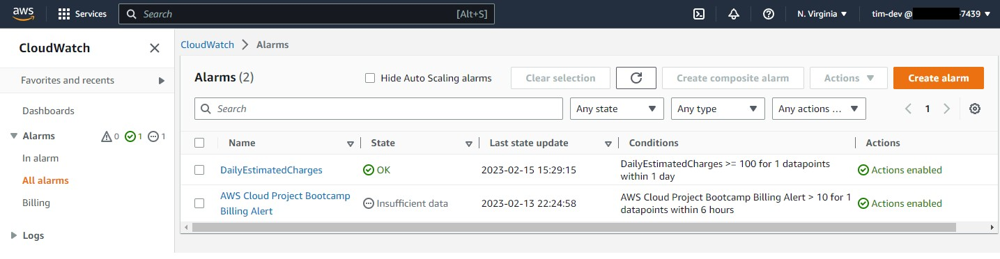

### Create Budget

I first set the Budget using _console_ before recreating it using _aws cli._

Using AWS CLI, we used the `budgets create-budget` command with the files [budget.json](../aws/json/budget.json) and [budget-notifications-with-subscribers.json](../aws/json/budget-notifications-with-subscribers.json). The budget created using CLI is **Example Tag Budget** and it has a budget of $100 since we also set our budget alarm to $100. **My AWS Cloud Project Bootcamp Cost Budget** is done using the console with the budget of $10.

I then checked the budgets using the `budgets describe-budgets` command.

| 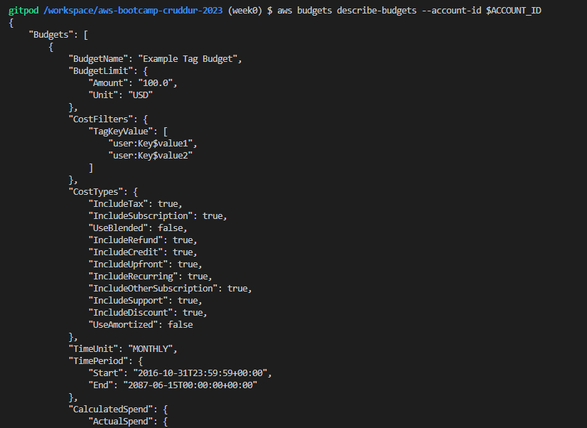 |
| --------------------------------------------------- |
|  |

We can also view the budgets on the console.
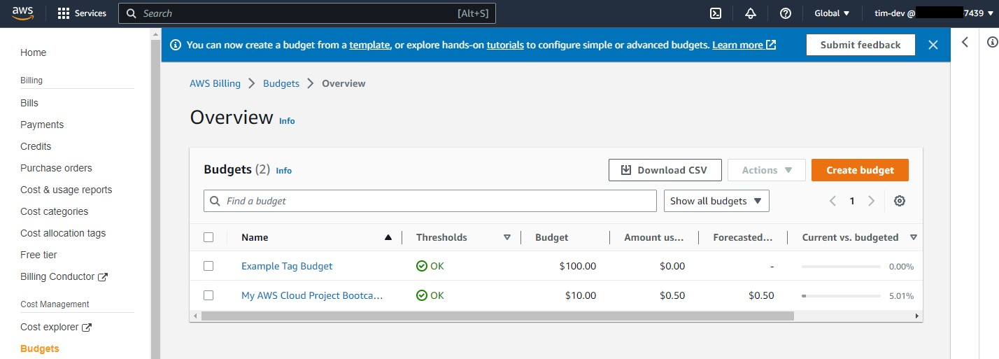

---

## Homework Challenges

### Set IAM MFA on root and admin account

- On Root Account
  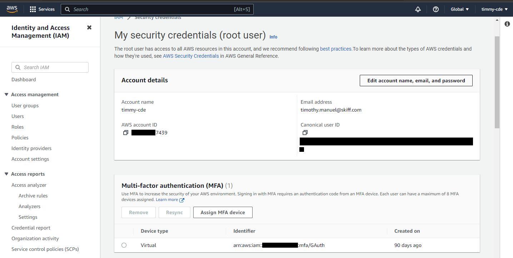

- On Admin Account
  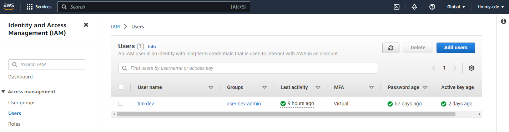

### Use EventBridge to hookup Health Dashboard to SNS and send notification when there is a service health issue.

In this part, I successfully created the eventbridge rule but I do not know how to test the AWS Health Dashboard to open an issue that will trigger the eventbridge to sent a notification on Amazon SNS.

Here we can see my event rule named as **Health-Event** and the event pattern source is set to `aws.health`.
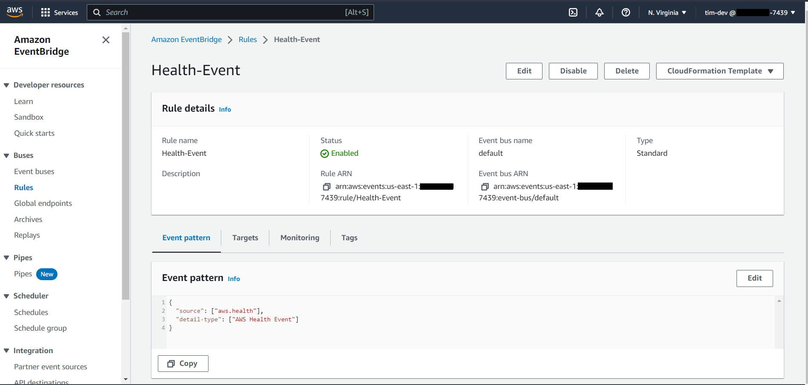

We can also see the target here as the SNS Topic I created named `health-eventbridge`.
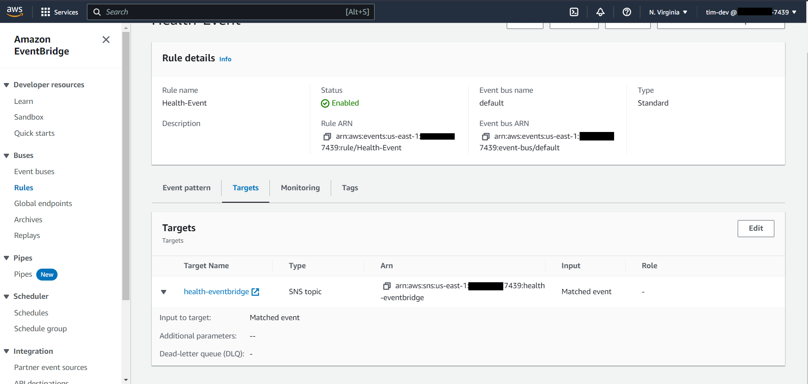

### Create an architectural diagram (to the best of your ability) the CI/CD logical pipeline in Lucid Charts

[CI/CD Logical Diagram Lucid Link](https://lucid.app/lucidchart/9f850bf7-19aa-49e5-a988-45324e5e6ac7/edit?view_items=C2hyuKXkKhQI&invitationId=inv_a3882301-a812-4ca9-9c76-822b1c0d9ffd)

