# Week 1 — App Containerization

## Required Homework

### Containerize Application
- Added Dockerfile on backend [(commit 2d4bc87)](https://github.com/timmy-cde/aws-bootcamp-cruddur-2023/commit/2d4bc87f7dee4926d0f594baf1801af559a9f031)
- Added Dockerfile on frontend [(commit e99542f)](https://github.com/timmy-cde/aws-bootcamp-cruddur-2023/commit/e99542fba076415abfaf098a19bccee7f93304d3)
- Added Docker Compose [(commit d7831fd)](https://github.com/timmy-cde/aws-bootcamp-cruddur-2023/commit/d7831fd2346ff86818f0be20182b95dab447ec5d)   
  
### Added Notifications Endpoint for OpenAI
- Link to [commit af86db6](https://github.com/timmy-cde/aws-bootcamp-cruddur-2023/commit/af86db6975ea92e7be6cc85ec13a390c2fd9c44a)

### Write Notifications backend endpoint
- Link to [commit d56cd74](https://github.com/timmy-cde/aws-bootcamp-cruddur-2023/commit/d56cd74086851d11ebde0216ad0f8e8bcb9fabbd)

### Write Notifications React Page
- Link to [commit a7beaff](https://github.com/timmy-cde/aws-bootcamp-cruddur-2023/commit/a7beaffd514db0c95a2dc62086270584e5e8edd6) and to [commit 3823dd2](https://github.com/timmy-cde/aws-bootcamp-cruddur-2023/commit/3823dd2c50e5447406fc817bdd06501909088494)

### Run Local DynamoDB container and Postgres container
- Added DynamoDB and Postgres to docker-compose.yml file [(commit 00d1feb)](https://github.com/timmy-cde/aws-bootcamp-cruddur-2023/commit/00d1feb9e517d284536f5f839cb2017000d70169)
- Added postgres vscode extension docker-compose.yml file [(commit c262e27)](https://github.com/timmy-cde/aws-bootcamp-cruddur-2023/commit/c262e27f368cd3eb2d1305fc5e9dec17f34749c8)
- Run the `docker compose up` command and we can see below that the port `8000` for DynamoDB and port `5432` for Postgres is running.
  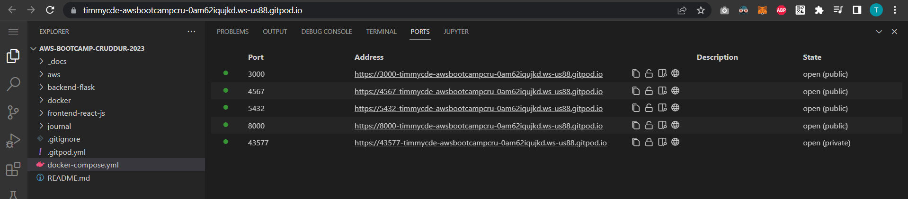
- Test DynamoDB locally
  - Create Table
    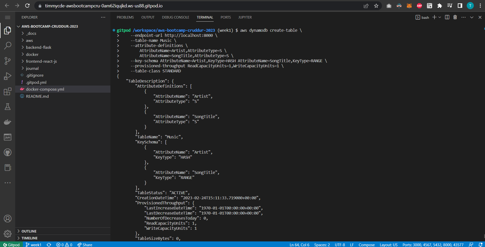
  - Create Item
    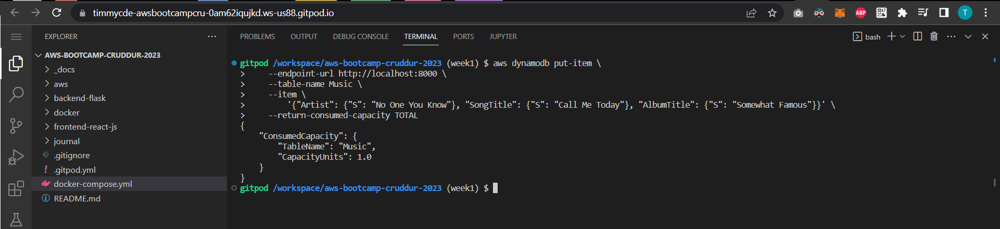
  - List Tables
    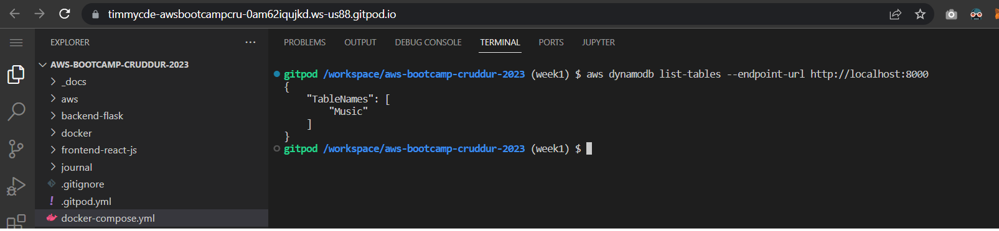
  - Get Records
    
  - Connect to postgres client
    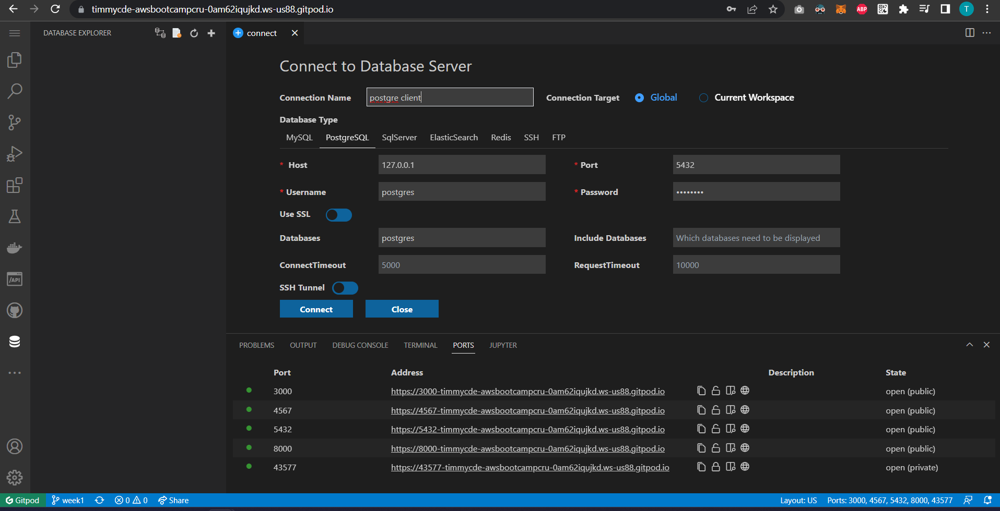
  - Connect to postgres cli

    We can see to the left that the postgres client is also connected
    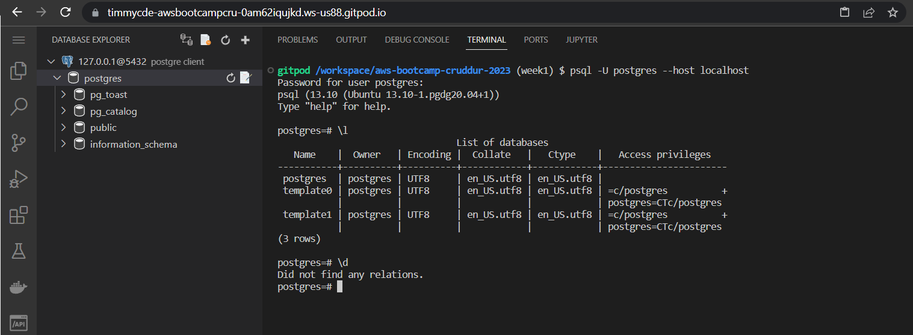

---
## Homework Challenges

### Run the dockerfile CMD as an external script
- I added scripts for the backend (backend-run.sh), frontend (frontend-run.sh) and in the .gitpod.yml file (run.sh file - which I later removed it and directly paste the command on the .gitpod.yml file) 
  - added scripts: [(commit 70bd078)](https://github.com/timmy-cde/aws-bootcamp-cruddur-2023/commit/70bd0785eb093899ab464350c08977017d4ee52d)
  - removed run.sh file and updated .gitpod.yml file: [(commit 300ef4e)](https://github.com/timmy-cde/aws-bootcamp-cruddur-2023/commit/300ef4e623906c1614012e3fbb354028f5fc8517)
- Build the Dockerfiles:
  - Backend:
    - 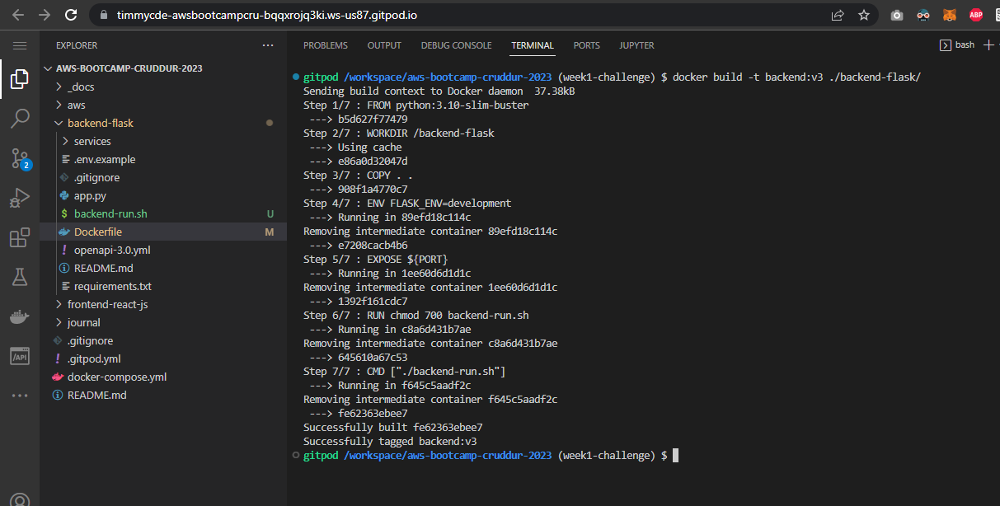
  - Frontend:
    - 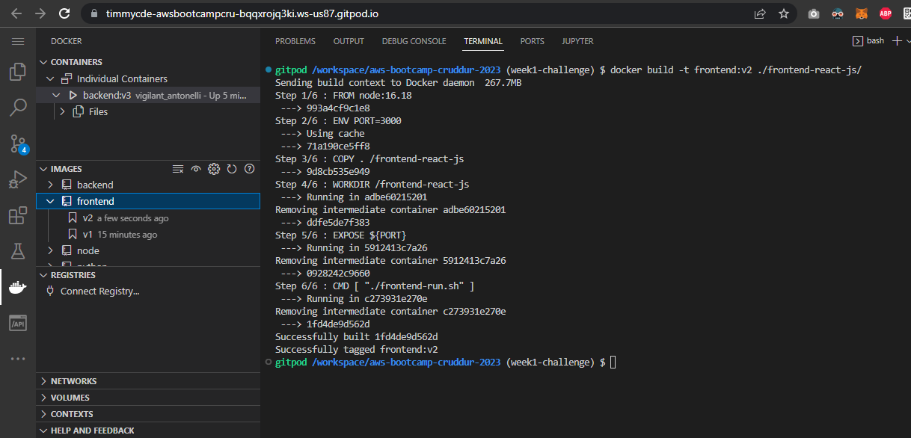
- Run the images using the commands:
  ```sh
  docker container run --rm -e FRONTEND_URL='*' -e BACKEND_URL='*' -p 4567:4567 -d backend:v3
  ```
  ```sh
  docker container run --rm -e REACT_APP_BACKEND_URL="https://4567-${GITPOD_WORKSPACE_ID}.${GITPOD_WORKSPACE_CLUSTER_HOST}" -p 3000:3000 -d frontend:v2
  ````
  
### Push and tag a image to DockerHub
- Login to Docker CLI
  ```sh
  docker login -u timmycde
  ```
  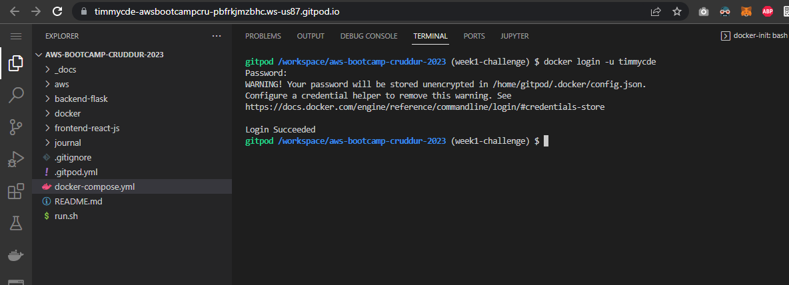
- Tag the images
  - Frontend:
    ```sh
    docker tag <IMAGE_ID> timmycde/cruddur-frontend:latest
    ```
  - Backend:
    ```sh
    docker tag <IMAGE_ID> timmycde/cruddur-backend:latest
    ```
- Push the images
  - Frontend:
    ```sh
    docker push timmycde/cruddur-frontend:latest
    ```
  - Backend:
    ```sh
    docker push timmycde/cruddur-backend:latest
    ```
- Logs
  
  Frontend:
  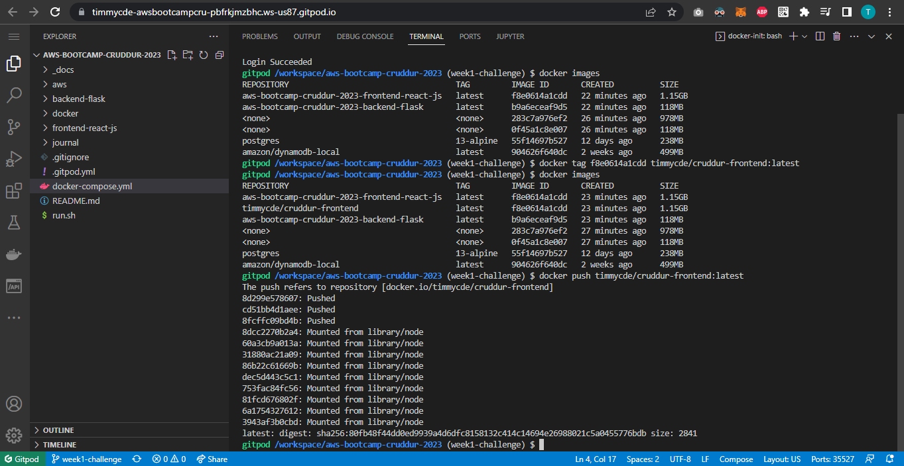
  
  Backend (*I made a mistake on the tag so I repeated it again*):
  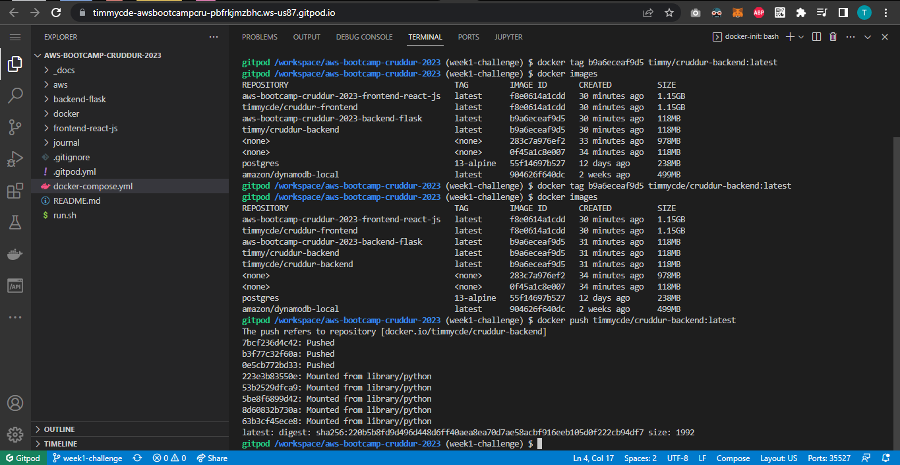
- Verify on the Docker Hub
  
  Docker Hub Links: [Backend](https://hub.docker.com/r/timmycde/cruddur-backend) | [Frontend](https://hub.docker.com/r/timmycde/cruddur-frontend)
  
  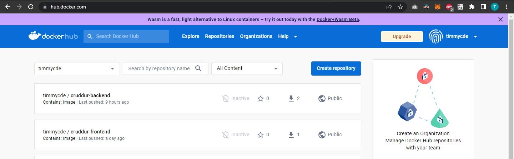
  
### Implement healthcheck to Docker compose file
Here I made healtchecks for the frontend and backend [commit 95e95c4](https://github.com/timmy-cde/aws-bootcamp-cruddur-2023/commit/95e95c4f4bdedcadbff93ffb3484e446b040dce3)

For some reason, I am getting unhealty status for the backend, but adding these on the `backend-run.sh` did the trick to make it healty! [(commit 928c798)](https://github.com/timmy-cde/aws-bootcamp-cruddur-2023/commit/928c7984362a64fae8b2739d97727315e729eac7)
```sh
apt-get update 
apt-get install -y gcc
apt-get install -y curl
```

### Install Docker and run the same containers locally


### Run the same containers inside an EC2 instance
  
  
  
