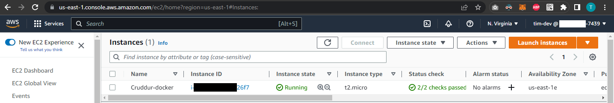

# Week 1 — App Containerization

## Table of Contents
| Required Homework| | Homework Challenges |
| :--- | :--- | :--- |
| [Containerize Application](#containerize-application) | | [Run the dockerfile CMD as an external script](#run-the-dockerfile-cmd-as-an-external-script) |
| [Added Notifications Endpoint for OpenAI](#added-notifications-endpoint-for-openai) | | [Push and tag a image to DockerHub](#push-and-tag-a-image-to-dockerhub) | 
| [Write Notifications backend endpoint](#write-notifications-backend-endpoint) | | [Implement healthcheck to Docker compose file](#implement-healthcheck-to-docker-compose-file) |
| [Write Notifications React Page](#write-notifications-react-page) | | [Install Docker and run the same containers locally](#install-docker-and-run-the-same-containers-locally) |
| [Run Local DynamoDB container and Postgres container](#run-local-dynamodb-container-and-postgres-container) | | [Run the same containers inside an EC2 instance](#run-the-same-containers-inside-an-ec2-instance) |
---

## Required Homework

### Containerize Application
- Added Dockerfile on backend [(commit 2d4bc87)](https://github.com/timmy-cde/aws-bootcamp-cruddur-2023/commit/2d4bc87f7dee4926d0f594baf1801af559a9f031)
  
  Build the image:
  ```sh
  docker build -t backend-flask ./backend-flask
  ```
  Run the container:
  ```sh
  docker run --rm -p 4567:4567 -it -e FRONTEND_URL='*' -e BACKEND_URL='*' backend-flask
  ```
  
- Added Dockerfile on frontend [(commit e99542f)](https://github.com/timmy-cde/aws-bootcamp-cruddur-2023/commit/e99542fba076415abfaf098a19bccee7f93304d3)

  Build the image:
  ```sh
  docker build -t frontend-react-js ./frontend-react-js
  ```
  Run the container:
  ```sh
  docker run -p 3000:3000 -e REACT_APP_BACKEND_URL='http://localhost:3000' -d frontend-react-js
  ```
- Added Docker Compose [(commit d7831fd)](https://github.com/timmy-cde/aws-bootcamp-cruddur-2023/commit/d7831fd2346ff86818f0be20182b95dab447ec5d)
  
  Build and run the container using the command `docker compose up`.
  
### Added Notifications Endpoint for OpenAI
- Link to [commit af86db6](https://github.com/timmy-cde/aws-bootcamp-cruddur-2023/commit/af86db6975ea92e7be6cc85ec13a390c2fd9c44a)

### Write Notifications backend endpoint
- Link to [commit d56cd74](https://github.com/timmy-cde/aws-bootcamp-cruddur-2023/commit/d56cd74086851d11ebde0216ad0f8e8bcb9fabbd)

### Write Notifications React Page
- Link to [commit a7beaff](https://github.com/timmy-cde/aws-bootcamp-cruddur-2023/commit/a7beaffd514db0c95a2dc62086270584e5e8edd6) and to [commit 3823dd2](https://github.com/timmy-cde/aws-bootcamp-cruddur-2023/commit/3823dd2c50e5447406fc817bdd06501909088494)

### Run Local DynamoDB container and Postgres container
- Added DynamoDB and Postgres to docker-compose.yml file [(commit 00d1feb)](https://github.com/timmy-cde/aws-bootcamp-cruddur-2023/commit/00d1feb9e517d284536f5f839cb2017000d70169)
- Added postgres vscode extension docker-compose.yml file [(commit c262e27)](https://github.com/timmy-cde/aws-bootcamp-cruddur-2023/commit/c262e27f368cd3eb2d1305fc5e9dec17f34749c8)
- Run the `docker compose up` command and we can see below that the port `8000` for DynamoDB and port `5432` for Postgres is running.
  
- Test DynamoDB locally
  - Create Table
    
  - Create Item
    
  - List Tables
    
  - Get Records
    
  - Connect to postgres client
    
  - Connect to postgres cli

    We can see to the left that the postgres client is also connected
    

---
## Homework Challenges

### Run the dockerfile CMD as an external script
- I added scripts for the backend (backend-run.sh), frontend (frontend-run.sh) and in the .gitpod.yml file (run.sh file - which I later removed it and directly paste the command on the .gitpod.yml file) 
  - added scripts: [(commit 70bd078)](https://github.com/timmy-cde/aws-bootcamp-cruddur-2023/commit/70bd0785eb093899ab464350c08977017d4ee52d)
  - removed run.sh file and updated .gitpod.yml file: [(commit 300ef4e)](https://github.com/timmy-cde/aws-bootcamp-cruddur-2023/commit/300ef4e623906c1614012e3fbb354028f5fc8517)
- Build the Dockerfiles:
  - Backend:
    - 
  - Frontend:
    - 
- Run the images using the commands:
  ```sh
  docker container run --rm -e FRONTEND_URL='*' -e BACKEND_URL='*' -p 4567:4567 -d backend:v3
  ```
  ```sh
  docker container run --rm -e REACT_APP_BACKEND_URL="https://4567-${GITPOD_WORKSPACE_ID}.${GITPOD_WORKSPACE_CLUSTER_HOST}" -p 3000:3000 -d frontend:v2
  ````
  
### Push and tag a image to DockerHub
- Login to Docker CLI
  ```sh
  docker login -u timmycde
  ```
  
- Tag the images
  - Frontend:
    ```sh
    docker tag <IMAGE_ID> timmycde/cruddur-frontend:latest
    ```
  - Backend:
    ```sh
    docker tag <IMAGE_ID> timmycde/cruddur-backend:latest
    ```
- Push the images
  - Frontend:
    ```sh
    docker push timmycde/cruddur-frontend:latest
    ```
  - Backend:
    ```sh
    docker push timmycde/cruddur-backend:latest
    ```
- Logs
  
  Frontend:
  
  
  Backend (*I made a mistake on the tag so I repeated it again*):
  
- Verify on the Docker Hub
  
  Docker Hub Links: [Backend](https://hub.docker.com/r/timmycde/cruddur-backend) | [Frontend](https://hub.docker.com/r/timmycde/cruddur-frontend)
  
  
  
### Implement healthcheck to Docker compose file
Here I made healthchecks for the frontend and backend [commit 95e95c4](https://github.com/timmy-cde/aws-bootcamp-cruddur-2023/commit/95e95c4f4bdedcadbff93ffb3484e446b040dce3)

For some reason, I am getting unhealty status for the backend, but adding these on both of the backend and frontend `Dockerfile` did the trick to make it healty! [(commit aefae65)](https://github.com/timmy-cde/aws-bootcamp-cruddur-2023/commit/aefae654f25fe963e89c8972408f466c0235f5bb)
```Dockerfile
RUN apt-get update 
RUN apt-get install -y gcc
RUN apt-get install -y curl
```

### Install Docker and run the same containers locally
- Downloaded the Docker Desktop application on the [Docker Website](docker.com) and run the application.
- Installed VSCode Docker Extension
- Cloned my github repository
- Replaced the environment variables of the `docker-compose.yml` file from `https://PORT-${GITPOD_WORKSPACE_ID}.${GITPOD_WORKSPACE_CLUSTER_HOST}` to `http://localhost:PORT`, where PORT is **3000** for frontend and **4567** for backend.
- Run the containers using `docker compose up` command and stop the containers using the `docker compose down` command.
- Log

  ```sh
  User@XXXX MINGW64 ~/Documents/Web Dev/aws-bootcamp-cruddur-2023 (week1)
  $ docker compose up
  [+] Running 5/5
   - Network aws-bootcamp-cruddur-2023_default                Created                                                                                      0.1s
   - Container aws-bootcamp-cruddur-2023-db-1                 Created                                                                                      0.2s
   - Container aws-bootcamp-cruddur-2023-backend-flask-1      Created                                                                                      0.2s
   - Container aws-bootcamp-cruddur-2023-frontend-react-js-1  Created                                                                                     31.2s
   - Container dynamodb-local                                 Created                                                                                      0.3s
  Attaching to aws-bootcamp-cruddur-2023-backend-flask-1, aws-bootcamp-cruddur-2023-db-1, aws-bootcamp-cruddur-2023-frontend-react-js-1, dynamodb-local
  aws-bootcamp-cruddur-2023-db-1                 | 
  aws-bootcamp-cruddur-2023-db-1                 | PostgreSQL Database directory appears to contain a database; Skipping initialization
  aws-bootcamp-cruddur-2023-db-1                 | 
  aws-bootcamp-cruddur-2023-db-1                 | 2023-02-25 13:21:02.638 UTC [1] LOG:  starting PostgreSQL 13.10 on x86_64-pc-linux-musl, compiled by gcc (Alp
  ine 12.2.1_git20220924-r4) 12.2.1 20220924, 64-bit
  aws-bootcamp-cruddur-2023-db-1                 | 2023-02-25 13:21:02.638 UTC [1] LOG:  listening on IPv4 address "0.0.0.0", port 5432
  aws-bootcamp-cruddur-2023-db-1                 | 2023-02-25 13:21:02.638 UTC [1] LOG:  listening on IPv6 address "::", port 5432
  aws-bootcamp-cruddur-2023-db-1                 | 2023-02-25 13:21:02.648 UTC [1] LOG:  listening on Unix socket "/var/run/postgresql/.s.PGSQL.5432"
  aws-bootcamp-cruddur-2023-db-1                 | 2023-02-25 13:21:02.661 UTC [22] LOG:  database system was shut down at 2023-02-24 08:53:56 UTC
  aws-bootcamp-cruddur-2023-db-1                 | 2023-02-25 13:21:02.680 UTC [1] LOG:  database system is ready to accept connections
  aws-bootcamp-cruddur-2023-frontend-react-js-1  | 
  aws-bootcamp-cruddur-2023-frontend-react-js-1  | > frontend@0.1.0 start
  aws-bootcamp-cruddur-2023-frontend-react-js-1  | > react-scripts start
  aws-bootcamp-cruddur-2023-frontend-react-js-1  |
  dynamodb-local                                 | Initializing DynamoDB Local with the following configuration:
  dynamodb-local                                 | Port:  8000
  dynamodb-local                                 | InMemory:      false
  dynamodb-local                                 | DbPath:        ./data
  dynamodb-local                                 | SharedDb:      true
  dynamodb-local                                 | shouldDelayTransientStatuses:  false
  dynamodb-local                                 | CorsParams:    null                                                                                         g
  eItem.css)!./node_modules/postcss-loader/dist/cjs.js??ruleSet[1].rules[1].oneOf[5].use[2]!./node_modules/source-map-loader/dist/cjs.js!./src/components/Messag
  aws-bootcamp-cruddur-2023-frontend-react-js-1  | Module Warning (from ./node_modules/postcss-loader/dist/cjs.js):
  aws-bootcamp-cruddur-2023-frontend-react-js-1  | Warning
  aws-bootcamp-cruddur-2023-frontend-react-js-1  | Compiled with warnings.2.18.0.3:4567
  aws-bootcamp-cruddur-2023-frontend-react-js-1  | (3:3) autoprefixer: start value has mixed support, consider using flex-start instead
  aws-bootcamp-cruddur-2023-frontend-react-js-1  | Warning
  aws-bootcamp-cruddur-2023-frontend-react-js-1  | webpack compiled with 3 warnings
  aws-bootcamp-cruddur-2023-backend-flask-1      | 172.18.0.1 - - [25/Feb/2023 13:22:24] "GET /api/activities/home HTTP/1.1" 200 -instead.
  aws-bootcamp-cruddur-2023-frontend-react-js-1  | Warning
  aws-bootcamp-cruddur-2023-frontend-react-js-1  | (3:3) autoprefixer: start value has mixed support, consider using flex-start instead
  aws-bootcamp-cruddur-2023-frontend-react-js-1  |  * Debugger PIN: 739-412-448
  aws-bootcamp-cruddur-2023-frontend-react-js-1  | Warning
  aws-bootcamp-cruddur-2023-frontend-react-js-1  | (3:3) autoprefixer: start value has mixed support, consider using flex-start instead
  aws-bootcamp-cruddur-2023-frontend-react-js-1  |
  aws-bootcamp-cruddur-2023-frontend-react-js-1  | Search for the keywords to learn more about each warning.
  aws-bootcamp-cruddur-2023-frontend-react-js-1  | To ignore, add // eslint-disable-next-line to the line before.
  aws-bootcamp-cruddur-2023-frontend-react-js-1  |
  aws-bootcamp-cruddur-2023-frontend-react-js-1  | WARNING in ./src/components/ActivityContent.css (./node_modules/css-loader/dist/cjs.js??ruleSet[1].rules[1].o
  ```

### Run the same containers inside an EC2 instance
- Launch an EC2 instance with the following properties and leave others in their default properties:
  - Name: Cruddur-docker
  - AMI: Amazon Linux 2 AMI (HVM) - Kernel 5.10 SSD
  - Instance Type: t2.micro
  - Generated a new Key Pair Login named `cruddur-docker.pem`
  - Security Group:
    - Inbound Rules: 22(ssh), 80(http), 443(https), 4567(tcp for backend), 3000(tcp for frontend)
    
  
- I used WSL here so I copied my `cruddur-docker.pem` file to my linux folder on the WSL terminal using the command 
  ```sh
  cp /mnt/c/Users/USERNAME/Downloads/cruddur-docker.pem ./Downloads
  ```
- Connect to EC2 instance using the command:
  ```sh
  ssh -i "cruddur-docker.pem" ec2-user@ec2-<PUBLIC_DNS>.compute-1.amazonaws.com
  ```
- Updated first the system using the command:
  ```sh
  sudo yum update
  ```
- Configure my aws identity using the command: 
  ```sh
  aws configure
  ```
- Verify the docker package is available in yum
  ```sh
  sudo yum search docker
  sudo yum info docker
  ```
- Install docker using the follwing command:
  ```sh
  sudo yum install docker
  ```
- Enable docker service
  ```sh
  sudo service docker start && sudo systemctl enable docker.service
  ```
- Verify the status of docker
  ```sh
   sudo systemctl status docker.service
  ```
  ```sh
  ● docker.service - Docker Application Container Engine
   Loaded: loaded (/usr/lib/systemd/system/docker.service; enabled; vendor preset: disabled)
   Active: active (running) since Thu 2023-02-23 15:06:45 UTC; 2 days ago
     Docs: https://docs.docker.com
   Main PID: 6587 (dockerd)
      Tasks: 10
     Memory: 37.3M
     CGroup: /system.slice/docker.service
             └─6587 /usr/bin/dockerd -H fd:// --containerd=/run/containerd/containerd.sock --default-ulimit n...
  Feb 25 13:50:53 ip-172-31-62-220.ec2.internal dockerd[6587]: time="2023-02-25T13:50:53.134948914Z" level=...34
  Feb 25 13:50:53 ip-172-31-62-220.ec2.internal dockerd[6587]: time="2023-02-25T13:50:53.136403357Z" level=...88
  Feb 25 13:50:53 ip-172-31-62-220.ec2.internal dockerd[6587]: time="2023-02-25T13:50:53.195345586Z" level=...e"
  Feb 25 13:50:53 ip-172-31-62-220.ec2.internal dockerd[6587]: time="2023-02-25T13:50:53.222389413Z" level=...e"
  Feb 25 13:58:08 ip-172-31-62-220.ec2.internal dockerd[6587]: time="2023-02-25T13:58:08.636446237Z" level=...63
  Feb 25 13:58:08 ip-172-31-62-220.ec2.internal dockerd[6587]: time="2023-02-25T13:58:08.687542250Z" level=...e"
  Feb 25 14:05:44 ip-172-31-62-220.ec2.internal dockerd[6587]: time="2023-02-25T14:05:44.829344467Z" level=...1e
  Feb 25 14:05:44 ip-172-31-62-220.ec2.internal dockerd[6587]: time="2023-02-25T14:05:44.831907611Z" level=...23
  Feb 25 14:05:44 ip-172-31-62-220.ec2.internal dockerd[6587]: time="2023-02-25T14:05:44.883484740Z" level=...e"
  Feb 25 14:05:44 ip-172-31-62-220.ec2.internal dockerd[6587]: time="2023-02-25T14:05:44.945953698Z" level=...e"
  Hint: Some lines were ellipsized, use -l to show in full.
  ```
- Pull my images on my dockerhub repo:
  ```sh
  sudo docker pull timmycde/cruddur-backend:latest
  sudo docker pull timmycde/cruddur-frontend:latest
  ```
- Verify the images:
  ```sh
  sudo docker images
  ```
  ```sh
  REPOSITORY                  TAG       IMAGE ID       CREATED        SIZE
  timmycde/cruddur-frontend   latest    f8e0614a1cdd   2 days ago     1.15GB
  timmycde/cruddur-backend    latest    b9a6eceaf9d5   2 days ago     118MB
  ```
- Run the images with the following command:
  ```sh
  sudo docker container run --rm -e FRONTEND_URL='*' -e BACKEND_URL='*' -p 4567:4567 -d timmycde/cruddur-backend:latest
  sudo docker container run --rm -e REACT_APP_BACKEND_URL="http://<EC2_PUBLIC_DNS>:4567" -p 3000:3000 -d timmycde/cruddur-frontend:latest
  ```
  > Here I struggled to make the backend connect to frontend, the problem that I found out by browsing into the network tab of the developer tools in the browser was the request link on the frontend becomes `http://<EC2_PUBLIC_DNS>:3000/<EC2_PUBLIC_DNS>:4567/api/activites/home` instead of `http://<EC2_PUBLIC_DNS>:4567/api/activites/home`. 
  
  > I later found out my error was how I declare my **EC2 Public DNS**. Since I saved my EC2 Public DNS to an environment variable as `$HOST_URL=$(curl http://169.254.169.254/latest/meta-data/public-ipv4)` and passing it directly to the docker `-e` option on the command causes this error (my command was `-e REACT_APP_BACKEND_URL="$HOST_URL:3000"`. So I tried to manually type the EC2 PUBLIC DNS directly on the command and it worked!
- Verify the containers are running:
  ```sh
  sudo docker ps
  ```
  ```sh
  [ec2-user@ip-172-31-62-220 ~]$ sudo docker ps
  CONTAINER ID   IMAGE                              COMMAND                  CREATED          STATUS          PORTS                                       NAMES
  e7c4d40d585f   timmycde/cruddur-frontend:latest   "docker-entrypoint.s…"   4 minutes ago    Up 4 minutes    0.0.0.0:3000->3000/tcp, :::3000->3000/tcp   interesting_hodgkin
  4f52d5567a9c   timmycde/cruddur-backend:latest    "./backend-run.sh"       12 minutes ago   Up 12 minutes   0.0.0.0:4567->4567/tcp, :::4567->4567/tcp   brave_lehmann
  ```
