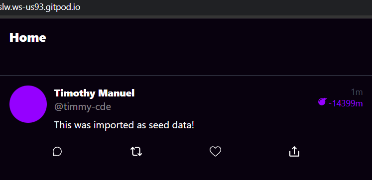
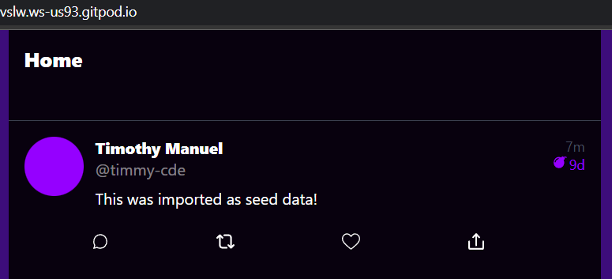
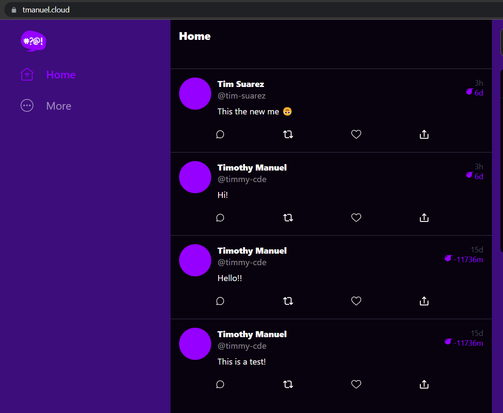

# Week 6 & 7 — Deploying Containers, Solving CORS with a Load Balancer and Custom Domain

## Required Homework

- [Watched ECS Fargate (Part 1)](https://www.youtube.com/watch?v=QIZx2NhdCMI&list=PLBfufR7vyJJ7k25byhRXJldB5AiwgNnWv&index=59&t=777s)
- [Watched ECS Fargate (Part 2)](https://www.youtube.com/watch?v=HHmpZ5hqh1I&list=PLBfufR7vyJJ7k25byhRXJldB5AiwgNnWv&index=59&pp=iAQB)
- [Watched Securing Flask](https://www.youtube.com/watch?v=9OQZSBKzIgs&list=PLBfufR7vyJJ7k25byhRXJldB5AiwgNnWv&index=60&pp=iAQB)
- [Watched Further Investigation into Werkzeug](https://www.youtube.com/watch?v=klhmczE4otI&list=PLBfufR7vyJJ7k25byhRXJldB5AiwgNnWv&index=61&pp=iAQB)
- [Watched Fix Messaging In Production](https://www.youtube.com/watch?v=HyJOjBjieb4&list=PLBfufR7vyJJ7k25byhRXJldB5AiwgNnWv&index=62&t=2170s&pp=iAQB)
- [Watched Implement Refresh Token Incognito](https://www.youtube.com/watch?v=LNLP2dxa5EQ&list=PLBfufR7vyJJ7k25byhRXJldB5AiwgNnWv&index=63&pp=iAQB)
- [Watched Configuring for Container Insights](https://www.youtube.com/watch?v=G_8_xtS2MsY&list=PLBfufR7vyJJ7k25byhRXJldB5AiwgNnWv&index=64&pp=iAQB)
- [Watched CORS, Load Balancing, Domains](https://www.youtube.com/watch?v=4WlrxtNqHbw&list=PLBfufR7vyJJ7k25byhRXJldB5AiwgNnWv&index=65&pp=iAQB)
- [Watched Maish's Fargate Technical Q&A](https://www.youtube.com/watch?v=w_YcwJxvoHQ&list=PLBfufR7vyJJ7k25byhRXJldB5AiwgNnWv&index=66&pp=iAQB)
- [Watched Implementing Timezones for ISO 8601](https://www.youtube.com/watch?v=g21EZ54c8iw&list=PLBfufR7vyJJ7k25byhRXJldB5AiwgNnWv&index=68&pp=iAQB)
- [Watched Ashish's Security Best Practices for Hosting Websites on AWS with Custom Domain](https://www.youtube.com/watch?v=MzVCEViI8Gg&list=PLBfufR7vyJJ7k25byhRXJldB5AiwgNnWv&index=68&t=1s)
- [Watched Ashish's ECS Security Best Practices](https://www.youtube.com/watch?v=zz2FQAk1I28&list=PLBfufR7vyJJ7k25byhRXJldB5AiwgNnWv&index=57&pp=iAQB)
- Completed Security Quiz

## Final Project Folder Directory Structure for this week

```sh
├── docs
│   └── assests
├── aws
│   ├── json
│   ├── lambdas
│   ├── policies
│   └── task definitions
├── backend-flask
│   ├── bin
│   ├── db
│   ├── lib
│   └── services
├── bin
│   ├── backend
│   ├── cognito
│   ├── db
│   ├── ddb
│   ├── ecr
│   ├── frontend
│   └── rds
├── erb
├── frontend
│   ├── public
│   └── src
│       ├── components
│       ├── lib
│       └── pages
└── journal
```

## Tasks

> For this week, to avoid complications on deploying the backend code to fargate, I reintegrated the previously decoupled authorization verification on week 3.

- Test RDS connection by running the script:

  ```sh
  #!/usr/bin/env python3

  import psycopg
  import os
  import sys

  connection_url = os.getenv("PROD_CONNECTION_URL")

  conn = None
  try:
    print('attempting connection')
    conn = psycopg.connect(connection_url)
    print("Connection successful!")
  except psycopg.Error as e:
    print("Unable to connect to the database:", e)
  finally:
    conn.close()
  ```

- Create health check route on `app.py`.
  ```py
  @app.route('/api/health-check')
  def health_check():
    return {'success': True}, 200
  ```
- Create a health check script

  ```sh
  #!/usr/bin/env python3

  import urllib.request

  try:
    response = urllib.request.urlopen('http://localhost:4567/api/health-check')
    if response.getcode() == 200:
      print("[OK] Flask server is running")
      exit(0) # success
    else:
      print("[BAD] Flask server is not running")
      exit(1) # false
  # This for some reason is not capturing the error....
  #except ConnectionRefusedError as e:
  # so we'll just catch on all even though this is a bad practice
  except Exception as e:
    print(e)
    exit(1) # false
  ```

- Create a CloudWatch group
  ```sh
  aws logs create-log-group --log-group-name "/cruddur/fargate-cluster"
  aws logs put-retention-policy --log-group-name "/cruddur/fargate-cluster" --retention-in-days 1
  ```
- Create an ECS Cluster
  ```sh
  aws ecs create-cluster \
  --cluster-name cruddur \
  --service-connect-defaults namespace=cruddur
  ```
- Login to ECR using the command below. Later on, we also created a script to login.
  ```sh
  aws ecr get-login-password --region $AWS_DEFAULT_REGION | docker login --username AWS --password-stdin "$AWS_ACCOUNT_ID.dkr.ecr.$AWS_DEFAULT_REGION.amazonaws.com"
  ```
- Create a private repository for Python
  ```sh
  aws ecr create-repository \
  --repository-name cruddur-python \
  --image-tag-mutability MUTABLE
  ```
- Get the repository url
  ```sh
  export ECR_PYTHON_URL="$AWS_ACCOUNT_ID.dkr.ecr.$AWS_DEFAULT_REGION.amazonaws.com/cruddur-python"
  echo $ECR_PYTHON_URL
  ```
- Pull the python docker image
  ```sh
  docker pull python:3.10-slim-buster
  ```
- Tag the python image
  ```sh
  docker tag python:3.10-slim-buster $ECR_PYTHON_URL:3.10-slim-buster
  ```
- Push the image to ECR

  ```sh
  docker push $ECR_PYTHON_URL:3.10-slim-buster
  ```

  > We later created scripts for these.

  > In addition to the python image, I also created a repository for the nodejs for the frontend and push it to ECR.

- In the `Dockerfile` for backend and frontend, replace the first line of code where the docker pulls the image to our private ECR image link.
- Create parameters at the Parameters Store of AWS.
- Create Task Execution Role named `CruddurServiceExecutionRole`.
  > After much debugging by Andrew Brown, these are the policies that worked.
  - CloudWatchFullAccess
  - CruddurServiceExecutionPolicy (Inline policy)
    ```json
    {
      "Version": "2012-10-17",
      "Statement": [
        {
          "Sid": "VisualEditor0",
          "Effect": "Allow",
          "Action": [
            "ecr:GetAuthorizationToken",
            "ecr:BatchCheckLayerAvailability",
            "ecr:GetDownloadUrlForLayer",
            "ecr:BatchGetImage",
            "logs:CreateLogStream",
            "logs:PutLogEvents"
          ],
          "Resource": "*"
        },
        {
          "Sid": "VisualEditor1",
          "Effect": "Allow",
          "Action": ["ssm:GetParameters", "ssm:GetParameter"],
          "Resource": "arn:aws:ssm:us-east-1:<ACCOUNT_ID>:parameter/cruddur/backend-flask/*"
        }
      ]
    }
    ```
- Create Task Role named `CruddurTaskRole`.
  > After much debugging by Andrew Brown, these are the policies that worked.
  - CloudWatchFullAccess
  - AWSXRayDaemonWriteAccess
  - SSMAccessPolicy (Inline Policy)
    ```json
    {
      "Version": "2012-10-17",
      "Statement": [
        {
          "Action": [
            "ssmmessages:CreateControlChannel",
            "ssmmessages:CreateDataChannel",
            "ssmmessages:OpenControlChannel",
            "ssmmessages:OpenDataChannel"
          ],
          "Effect": "Allow",
          "Resource": "*"
        }
      ]
    }
    ```
- Create task definition for the backend.
- Build the backend, create ECR repo for backend and push the image to the ECR.
- Setup the Load Balancers, Target Groups , Security Groups(ECS and ALB).
- Set up the Route53 Hosted Zone. In my case, I bought my domain to Hostinger, so I changed my nameservers in my Hostinger Dashboard to the Route53 nameservers.
- Request for a Public Certificate in the AWS Certificate Manager.
- Register the Backend Task Definition using the command:
  ```sh
  aws ecs register-task-definition --cli-input-json file://aws/task-definitions/backend-flask.json
  ```
- Create the backend service and run it using the command below and check the status of the health check
  ```sh
  aws ecs create-service --cli-input-json file://aws/json/service-backend-flask.json
  ```
- Install Session Manager Plugin on cli to be able to connect to the ECS service.
- Create script to connect to ECS Service.
- Create a `Dockerfile.prod` and `nginx.conf` configuration file for the frontend.
- Build the frontend image using the command below, create ECR repo for frontend and push the image to the ECR.
  ```sh
  docker build \
  --build-arg REACT_APP_BACKEND_URL="https://4567-$GITPOD_WORKSPACE_ID.$GITPOD_WORKSPACE_CLUSTER_HOST" \
  --build-arg REACT_APP_AWS_PROJECT_REGION="$AWS_DEFAULT_REGION" \
  --build-arg REACT_APP_AWS_COGNITO_REGION="$AWS_DEFAULT_REGION" \
  --build-arg REACT_APP_AWS_USER_POOLS_ID=<VALUE> \
  --build-arg REACT_APP_CLIENT_ID=<VALUE> \
  -t frontend-react-js \
  -f Dockerfile.prod \
  .
  ```
- Create task definition for the frontend, and register it using the command:
  ```sh
  aws ecs register-task-definition --cli-input-json file://aws/task-definitions/frontend-react-js.json
  ```
- Create the frontend service and run it using the command below:
  ```sh
  aws ecs create-service --cli-input-json file://aws/json/service-frontend-react-js.json
  ```
- Refactor the backend script and create the frontend script for for connecting to ecs service.
- Add health check and load balancer for the frontend task definition.
- Revise the `FRONTEND_URL` and `BACKEND_URL` environment variable in the backend task definition to my own domain namely: `tmanuel.cloud` and `api.tmanuel.cloud` respectively.
- Create a `Dockerfile.prod` for the backend production where the debuggers are disabled.
- Create the scripts for building and running the images.
  > This is where I also thought I did not expose my keys like Andrew Brown did, but boy I was wrong. I forget to delete the docker commands with the env keys in the _run_ script since I commented it and I pushed it to my repo. So I have to rotate my keys. 🫠🙃🤣
- Restructure the bash commands like in the diagram [above](#final-project-folder-directory-structure-for-this-week).
- Update the health check on the backend task definition.
- Refactor the `CheckAuth.js` file so that the access token can refresh.
- Import the `getAccesstoken()` function in:
  - HomeFeedPage.js
  - MessageForm.js
  - MessageGroupNewPage.js
  - MessageGroupPage.js
  - MessageGroupPages.js
    > Here I noticed that my frontend build and the session manager installer is being pushed to the repo even though I already included it on the .gitignore files, so I added it again to the other .gitignore files and deleted the build and installer files.
- Added the xray in the backend task definition with health check
- Enable the xray codes in my `app.py` and `user_activities.py` file.
- Create scripts for the backend and frontend register and run.
- Change all the `init` keyword in the `.gitpod.yml` file into `before` keyword.
- Refactor the `docker-compose.yml` file to have the environment variables in an external file, change the network name and add it to every service.
- Create a busybox script.
- Create a ruby script to generate the env files of backend and frontend.
- Remove the health check in the xray container of the backend task definition.
- Update the `bin/ddb/seed` file variables:

  ```py
  now = datetime.now()

  created_at = (now - timedelta(days=1) + timedelta(minutes=i)).isoformat()
  ```

- Update the `backend-flask/lib/ddb.py` file variables:
  ```py
  created_at = datetime.now().isoformat()
  ```
- Create a `DateTimeFormats.js` lib in the frontend-react-js folder and import it to:

  - ActivityContent.js
  - MessageGroupItem.js
  - MessageItem.js

  and the css:

  - MessageItem.css

## Debugging

- I sometimes cannot connect to the RDS.
  > Resolved it by manually updating the SG rule of PostgreSQL for the Gitpod IP.
- I cannot access my backend in the deployed website since my `REACT_APP_BACKEND_URL` that is showing in my Network tab is: `https://<FRONTEND_URL>/<BACKEND_URL>/api/activities/home` instead of `https://<BACKEND_URL>/api/activities/home`.

  > Resolved it by:

  > - Testing my code locally on Gitpod and check if the correct Backend Url is passed in the network tab.
  > - Build the backend and frontend and push the images in ECR.
  > - Pull the images in ECR and run it locally on Gitpod.
  > - I got the correct Backend link on the Frontend so I redeployed my ECS Services and it worked!

## Homework Challenges

- Created a private Nodejs repository for the frontend.
- Added the `time_future()` function to the `DateTimeFormat.js` file so that the time remaining in the HomeFeedPage is not negative.

  - Before:

    ```js
    // ActivityContent.js

    expires_at = (
      <div
        className="expires_at"
        title={format_datetime(props.activity.expires_at)}
      >
        <BombIcon className="icon" />
        <span className="ago">{time_ago(props.activity.expires_at)}</span>
      </div>
    );
    ```

    

  - After:

    ```js
    // DateTimeFormats.js

    export function time_future(value) {
      const datetime = DateTime.fromISO(value, { zone: "utc" });
      const future = datetime.setZone(
        Intl.DateTimeFormat().resolvedOptions().timeZone
      );
      const now = DateTime.now();
      const diff_mins = future.diff(now, "minutes").toObject().minutes;
      const diff_hours = future.diff(now, "hours").toObject().hours;
      const diff_days = future.diff(now, "days").toObject().days;

      if (diff_hours > 24.0) {
        return `${Math.floor(diff_days)}d`;
      } else if (diff_hours < 24.0 && diff_hours > 1.0) {
        return `${Math.floor(diff_hours)}h`;
      } else if (diff_hours < 1.0) {
        return `${Math.round(diff_mins)}m`;
      }
    }
    ```
    ```js
    // ActivityContent.js

    expires_at = (
      <div
        className="expires_at"
        title={format_datetime(props.activity.expires_at)}
      >
        <BombIcon className="icon" />
        <span className="ago">{time_future(props.activity.expires_at)}</span>
      </div>
    );
    ```

    

    > The dates past the current date though are stil negatives.
    
    
